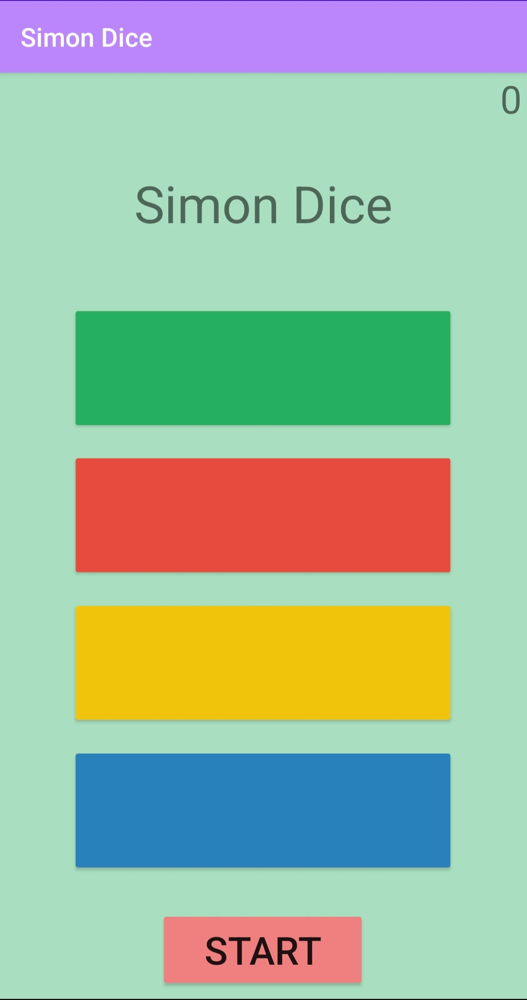
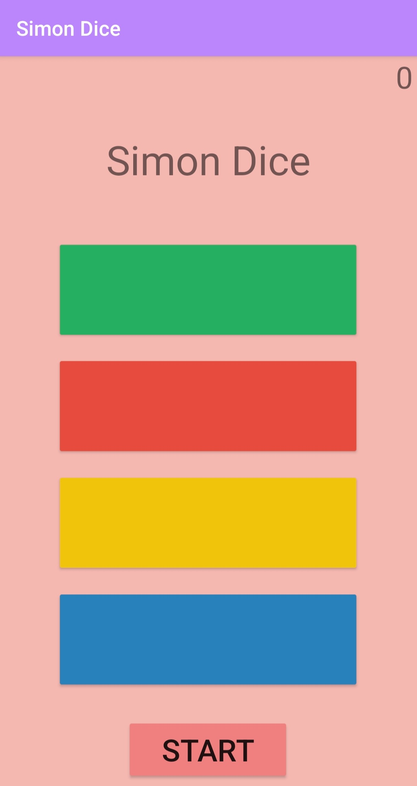
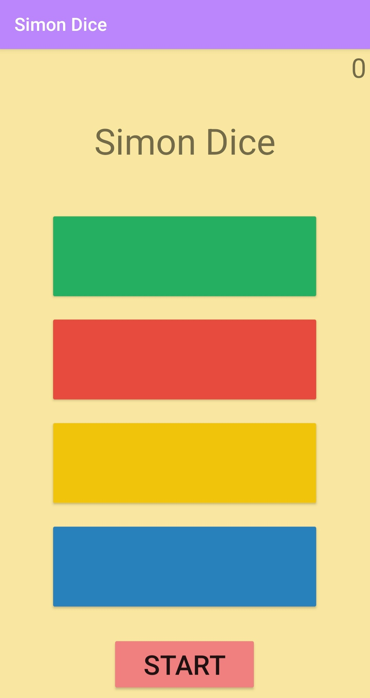

# Simón Dice
Simón Dice es un juego, que proveé ordenes aleatorias y comprueba que estas sean cumplidas en el orden correcto.
Cada orden indica un nuevo color que debemos que debemos agregar a la secuencia que llevemos hasta el momento, cada
vez que se introduzca la secuencia de manera correcta se sumará un punto a la puntuación total del jugador, 
si se introduce un color diferente al color correspondiente de la secuencia, el juego se acabará y 
llevará al jugador al menú de finalización donde podrá elegir reiniciar el mismo o salir de la aplicación.  

En está imagen podemos ver el menú de inicio del juego, en donde se podrá cambiar el color de fondo
al color del botón que se presione o comenzar el propio.  

  

Estos son los diferentes colores de fondo que se quedarían en la aplicación: Verde, Rojo, Amarillo y Azul  

  

  

  

  

Aquí podemos ver como es el principio del juego, la primera instrucción, en la que solamente se tendría
que presionar el botón del color que Simón dice.  

  

El menú de pausa del juego, que solo salta si nos salimos del juego, ya que no se dispone de un botón
de pausa dentro del mismo juego. Este menú consta de tres botones, uno para continuar con la misma 
partida, uno para comenzar una partida nueva y otro botón para salir del juego, además de estos botones
cuenta con un texto que indica que nos encontramos en una pausa.  

  

Después de la pausa el juego sigue funcionando de manera normal, teniendo que indicar la secuencia completa,
o en el punto que nos quedamos antes de provocar la pausa.  

  

Por último nos encontramos con el menú final, el cual solo aparece si perdemos en el juego, este 
menú cuenta con un botón para comenzar una nueva partida, un botón para salir de la aplicación y un 
texto que nos indica que se perdió el juego.  

   

